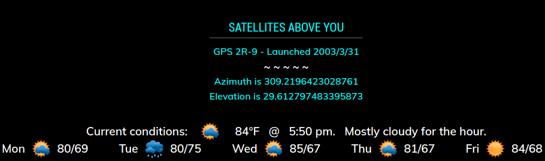

## MMM-Satellites

* A rotation of Satelittes that are above your location at this very moment

For astromers with telescopes capable of automatic tracking, or if you just want to know.
You could track manually but that would be fairly difficult.

## Example

## 1, 2, 3

* You get the azimuth (direction) value (in degrees) of the satellites location

* You get the elevation (in degrees) of the satellites location

* The identification and launch date of the satellite

## Installation

* `git clone https://github.com/mykle1/MMM-Satellites` into the `~/MagicMirror/modules` directory.

* `npm install` in your `~/MagicMirror/modules/MMM-Satellites` directory.

## Config.js entry and options

    {
           disabled: false,
           module: 'MMM-Satellites',
           position: 'top_left',
		   config: {
			    latitude: "Your Latitude",
                longitude: "Your Longitude",
                useHeader: false,    // true if you want a header      
                header: "",          // Any text you want. useHeader must be true
                maxWidth: "300px",
                rotateInterval: 30*1000,
                initialLoadDelay: 1250,
                retryDelay: 2500,
                updateInterval: 60*60*1000,
		}
    },
	
## SpaceCowboysDude gets props once again.